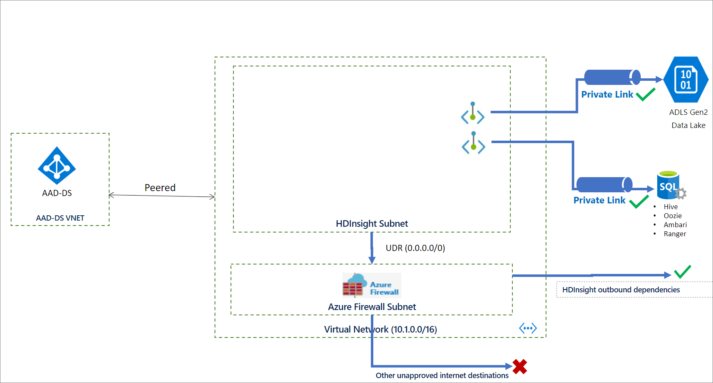
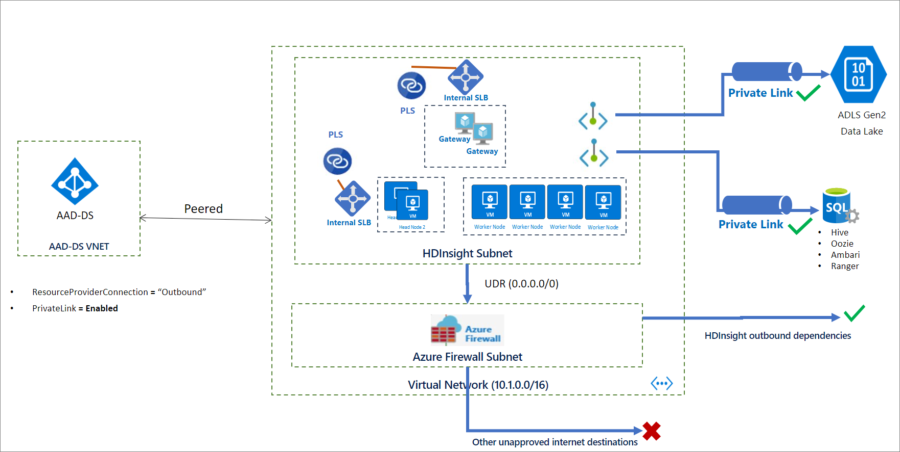
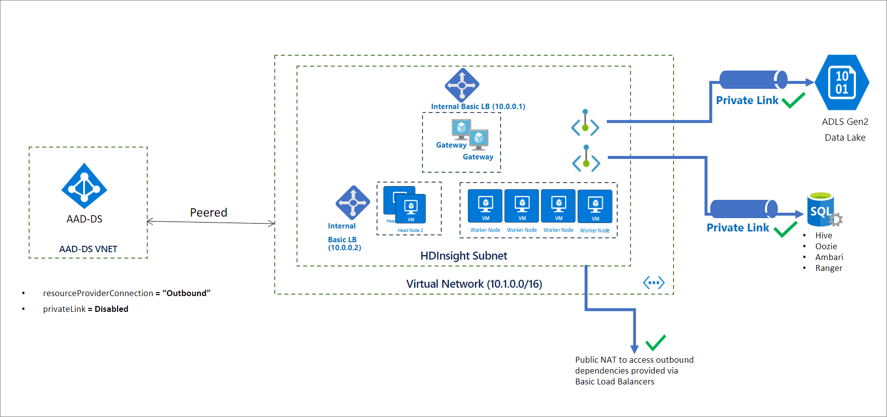

# HDInsight Kafka Clusters

## Deployment options

There are [several options](https://docs.microsoft.com/en-us/azure/hdinsight/cluster-management-best-practices#how-do-i-create-hdinsight-clusters) in how to deploy HDI Kafka Clusters. Other then Azure Portal, CLI, PowerShell and Azure Rest API, template based options are as follows:
* [ARM Template](https://github.com/Azure/azure-quickstart-templates/tree/master/101-hdinsight-kafka)
* [Terraform](https://registry.terraform.io/providers/hashicorp/azurerm/latest/docs/resources/hdinsight_kafka_cluster)

## Private link preview:

For now we have no ready template for this configuration. if you want to deploy kafka cluster with private link and no public IPs,there are some key prep points that you should be following. Private link configuration is only available with HDInsight RM behavior being Outbound.

Blocking inbound traffic and restricting outbound traffic requires some preparation steps including, virtual network  preparation with necessary subnets.

1. Creating a Logical SQL server with 3 Azure SQL  Databases for External Ambari, Hive and Oozie Metastores.:star:
    * For the SQL server you need to whitelist [HDI Management service IPs](https://docs.microsoft.com/en-us/azure/hdinsight/hdinsight-management-ip-addresses#health-and-management-services-all-regions).:star:
    *  Allow access all Azure Services
1. Create and provide the storage account upfront.
    * Keep Storage account as public :worried:
    * Whitelist [HDI Management service IPs](https://docs.microsoft.com/en-us/azure/hdinsight/hdinsight-management-ip-addresses#health-and-management-services-all-regions).:star:
1. Create a subnet for hdinsight with an NSG. 
    * Whitelist [HDI Management service IPs](https://docs.microsoft.com/en-us/azure/hdinsight/hdinsight-management-ip-addresses#health-and-management-services-all-regions) for outbound. :star:
1. Create private links for the Logical SQL server and Storage account into the HDInsight dedicated subnet.:star:
1. This may sound weird, but [disable private endpoint policies for HDInsight subnet](https://docs.microsoft.com/en-us/azure/private-link/disable-private-link-service-network-policy#using-azure-cli) :open_mouth:.
```command

az network vnet subnet update   --name <your HDInsight Subnet>  --resource-group <your HDInsight vnets resource group>   --vnet-name <your HDInsight vnet> --disable-private-link-service-network-policies true

```
Because HDinsight privatelink cluster have Standart load balancers isntead of basic, we need to congfigure a NAT solution or Firewall to route the outbound traffic to the HDInSight Resource manager IPs.
1. Create a Firewall in a dedicated firewall subnet.
1. Create a route table
1. Configure Firewall app and network rules and routing table accourding to [this guidance](https://docs.microsoft.com/en-us/azure/hdinsight/hdinsight-restrict-outbound-traffic)
1. Associate the routing table with the HDInsight Subnet.

The network and service architecture will be like below before provisioning:



During the provisioning,

* Remove public IP addresses by setting `resourceProviderConnection`  to `outbound`. :star:
* Enable Azure Private Link and use Private Endpoints by setting `privateLink` to `enabled`.

After provisioning the architecture will be like below:



If you only aim to limit outbound connection without private link your Cluster will still have the basic load balancers, you can perform only the steps that are marked with :star: . since the cluster will be deployed with basic load balancers which provides NAT by defult you wont need a Firewall definition. So your network architecture will be as below:



For Additional information on how to control network  traffic you can [use this gudaince](https://docs.microsoft.com/en-us/azure/hdinsight/control-network-traffic)

**If you want to use Kafka with vnet peering, you need to change the kafka broker setting to [advertise ip addresses](https://docs.microsoft.com/en-us/azure/hdinsight/kafka/apache-kafka-connect-vpn-gateway#configure-kafka-for-ip-advertising) instead of FQDNs.**

## Testing Kafka Cluster from  Cloud Shell

*reference guide doc for below steps: https://docs.microsoft.com/en-us/azure/hdinsight/kafka/apache-kafka-get-started#connect-to-the-cluster*

1.  ssh to cluster:
    ```console
    ssh sshuser@<yourclustername>-ssh.azurehdinsight.net
    ```

1.  set config for the session:

     Install jq, a command-line JSON processor. 

    ```console
    sudo apt -y install jq
    ```

1.  convert password to env variable for the seesion to use in the comments:
    ```console
    export password='<youradminpassword>'
    ```

1. Extract the correctly cased cluster name
    ```console
    export clusterName=$(curl -u admin:$password -sS -G "http://headnodehost:8080/api/v1/clusters" | jq -r '.items[].Clusters.cluster_name')
    ```

1.  set an environment variable with Zookeeper host information,
    ```console
    export KAFKAZKHOSTS=$(curl -sS -u admin:$password -G https://$clusterName.azurehdinsight.net/api/v1/clusters/$clusterName/services/ZOOKEEPER/components/ZOOKEEPER_SERVER | jq -r '["\(.host_components[].HostRoles.host_name):2181"] | join(",")' | cut -d',' -f1,2);

    echo $KAFKAZKHOSTS
    ```

1. set an environment variable with Apache Kafka broker host information
    ```console
    export KAFKABROKERS=$(curl -sS -u admin:$password -G https://$clusterName.azurehdinsight.net/api/v1/clusters/$clusterName/services/KAFKA/components/KAFKA_BROKER | jq -r '["\(.host_components[].HostRoles.host_name):9092"] | join(",")' | cut -d',' -f1,2);

    echo $KAFKABROKERS
    ```
1. create topic *(You can create topics automatically for test or reliability purposes. To do that we need to go to Ambari, kafka, config,  and set `auto.create.topics.enable` to `true` from Advanced kafka broker settings,  then restart all)*
    ```console
    /usr/hdp/current/kafka-broker/bin/kafka-topics.sh --create --replication-factor 3 --partitions 4 --topic test --zookeeper $KAFKAZKHOSTS

    ```
1.  list topic:
    ```console
    /usr/hdp/current/kafka-broker/bin/kafka-topics.sh --list --zookeeper $KAFKAZKHOSTS
    ```
1 . write records to the topic:
    ```console
    /usr/hdp/current/kafka-broker/bin/kafka-console-producer.sh --broker-list $KAFKABROKERS --topic test
    ```

1.  read records from the topic:
    ```console
    /usr/hdp/current/kafka-broker/bin/kafka-console-consumer.sh --bootstrap-server $KAFKABROKERS --topic test --from-beginning
    ```

You can also use below sample python consumer and producer applicataions from a VM client:
* Producer: [KafkaProducer.ipynb](notebooks/KafkaProducer.ipynb)
* ProducConsumerer: [KafkaConsumer.ipynb](notebooks/KafkaConsumer.ipynb)

## Scaling the Cluster

HDInsight Kafka clusters does [not support autoscale](https://docs.microsoft.com/en-us/azure/hdinsight/hdinsight-autoscale-clusters#cluster-compatibility) due to the nature of broker and partition setup of auto downscale behavior.

You should [rebalance kafka partitions and replicas](https://github.com/hdinsight/hdinsight-kafka-tools) after scaling operations.

## High Availability of HDInsight Kafka

HDInsight cluster nodes are spread into different Fault domains to prevent loss in case of an issue in a specific [fault domain](https://docs.microsoft.com/en-us/archive/msdn-magazine/2015/september/microsoft-azure-fault-tolerance-pitfalls-and-resolutions-in-the-cloud#fault-domains-and-upgrade-domains).

Kafka as an application is not rack and in case of Azure Fault Domain aware. To get the Kafka topics also highly available as the nodes by means of Fault Domains, you need to run [partition rebalance tool](https://github.com/hdinsight/hdinsight-kafka-tools) in case of new cluster creation, when a new topic/partition is created,cluster is scaled up.

There is no built in multi region configuration for HDI Kafka. you can use [MirrorMaker](https://docs.microsoft.com/en-us/azure/hdinsight/kafka/apache-kafka-mirroring) to replicate the cluster.

https://docs.microsoft.com/en-us/azure/hdinsight/kafka/apache-kafka-high-availability

## Maintenance of the cluster

1. **Upgrading HDI and Kafka version:** HDInsight does not support in-place upgrades where an existing cluster is upgraded to a newer component version. You must create a new cluster with the desired component and platform version and then migrate your applications to use the new cluster. For more detail read [here](https://docs.microsoft.com/en-us/azure/hdinsight/hdinsight-upgrade-cluster)

2. **Patching HDI:** Running clusters aren't auto-patched. Customers must use script actions or other mechanisms to patch a running cluster. For more detail read [here](https://docs.microsoft.com/en-us/azure/hdinsight/hdinsight-os-patching)

## Security
1. **Network Security:** We described network securty options above.
1. **Authentication:**  [Enterprise Security Package](https://docs.microsoft.com/en-us/azure/hdinsight/domain-joined/hdinsight-security-overview) from HDInsight provides Active Directory-based authentication, multi-user support, and role-based access control. The Active Directory integration is achieved through the use of [Azure Active Directory Domain Services](.https://docs.microsoft.com/en-us/azure/active-directory-domain-services/overview). With these capabilities, you can create an HDInsight cluster joined to an Active Directory domain. Then configure a list of employees from the enterprise who can authenticate to the cluster.
For example, the admin can configure [Apache Ranger](https://ranger.apache.org/) to set access control policies for Hive. This functionality ensures row-level and column-level filtering (data masking). And filter the sensitive data from unauthorized users.

User syncing for Apache Ranger and Ambari access has to be done seperately since these services dont use the same metastore.
The guidance can be find [here](https://docs.microsoft.com/en-us/azure/hdinsight/domain-joined/ldap-sync)

1. **Auditing:** The HDInsight admin can view and report all access to the HDInsight cluster resources and data. The admin can view and report changes to the access control policies. To access Apache Ranger and Ambari audit logs, and ssh access logs, [enable Azure Monitor](https://docs.microsoft.com/en-us/azure/hdinsight/hdinsight-hadoop-oms-log-analytics-tutorial#cluster-auditing) and view the tables that provide auditing records.

1. **Encryption:** HDInsight supports data encryption at rest with both platform managed and [customer managed keys](https://docs.microsoft.com/en-us/azure/hdinsight/disk-encryption). Encryption of data in transit is handled with both TLS and IPSec. See [Encryption in transit for Azure HDInsight](https://docs.microsoft.com/en-us/azure/hdinsight/domain-joined/encryption-in-transit) for more information.

    **Important:**  Using private endpoints for Azure Key Vault is not supported by HDInsight. If you're using Azure Key Vault for CMK encryption at rest, the Azure Key Vault endpoint must be accessible from within the HDInsight subnet with no private endpoint.

More details on Security you can find here:
https://docs.microsoft.com/en-us/azure/hdinsight/domain-joined/hdinsight-security-overview

For ACL integration with ADLS you can follow below guidance:
https://azure.microsoft.com/en-us/blog/azure-hdinsight-integration-with-data-lake-storage-gen-2-preview-acl-and-security-update/
